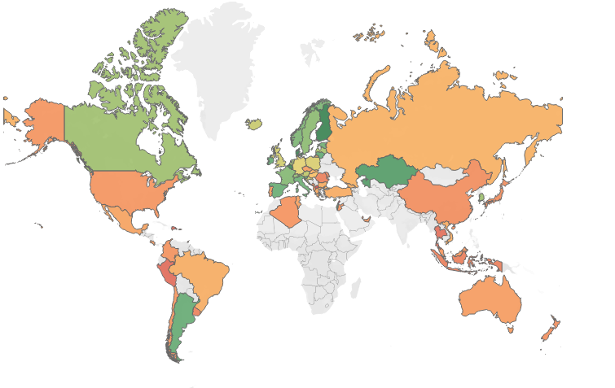
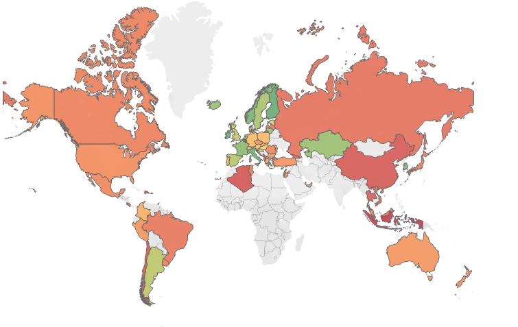
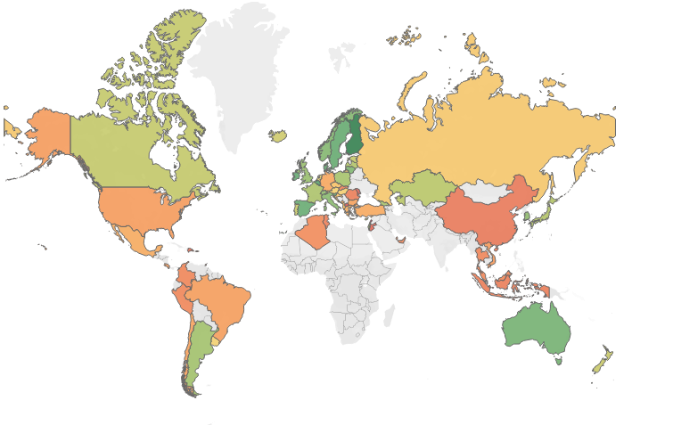

# World-Education-Quality-Analysis
### Authored by : Sean Bjork

## Motivating Questions
- Which countries have the best overall education quality?
- Which factors of education best predict overall quality?
  - Why do countries such as the US spend "top dollar" for an education system that isn't also top quality?

## Data
- UNESCO UIS: Education Statistics
  - United Nations Educational, Scientific and Cultural Organization Institute for Statistics
    - http://data.uis.unesco.org/#
- PISA IDE Score Reports in Math, Reading, & Science
  - Program for International Student Assessment International Database Explorer
    - https://pisadataexplorer.oecd.org/ide/idepisa/
- The World Bank: IBRD & IDA Education Statistics
  - International Bank for Reconstruction and Development & International Development Association
    - https://datacatalog.worldbank.org/dataset/education-statistics

## Repository Structure
### Data:
- UIS
  - (./data/UIS/EDULIT_DS_23082019165936814.csv.csv) # First download
  - (./data/UIS/EDULIT_DS_25082019015237837.csv) # Second download 
  - (./data/UIS/uis.csv) # Cleaned data
- PISA
  - (./data/pisa/math_report-Table 1.csv) # Math scores
  - (./data/pisa/reading_report-Table 1.csv) # Reading scores
  - (./data/pisa/science_report-Table 1.csv) # Science scores
  - (./data/pisa/pisa.csv) # Cleaned data
- World Bank
  - (./data/world_bank/API_4_DS2_en_csv_v2_103930.csv) # Data download
  - (./data/world_bank/world_bank.csv) # Cleaned data
- Modeling
  - (./data/modeling/original_stats.csv) # Combined data
  - (./data/modeling/scaled_stats.csv) # Scaled data with indexes
  - (./data/modeling/tableau_df.csv) # Formatted for Tableau

### Notebooks:
- Cleaning:
  - (./notebooks/UIS_cleaning.ipynb)
  - (./notebooks/PISA_cleaning.ipynb)
  - (./notebooks/world_bank_cleaning.ipynb)
- Preprocessing & Feature Engineering
  - (./notebooks/preprocessing_engineering.ipynb)
- EDA & Modeling
  - (./notebooks/EDA_modeling.ipynb)

### Visuals
- Tables & Heat Maps:
  - (./visuals/ed_qual_2000.png)
  - (./visuals/ed_qual_2003.png)
  - (./visuals/ed_qual_2006.png)
  - (./visuals/ed_qual_2009.png)
  - (./visuals/ed_qual_2012.png)
  - (./visuals/ed_qual_2015.png)
  - (./visuals/ed_qual_correlations.png)
  - (./visuals/climate_correlations.png)
  - (./visuals/learning_correlations.png)
  - (./visuals/resources_correlations.png)
  - (./visuals/top_ed_qual.png)
  - (./visuals/top_climate.png)
  - (./visuals/top_learning.png)
  - (./visuals/top_resources.png)
  - (./visuals/yearly_ed_qual.png)
  - (./visuals/education_expenditure.jpg)

### Slide Deck
- Presentation:
  - (./slides/education_analysis_slides.pdf)

## Executive Summary
Based on several readings about measuring education quality, namely the feature selection therefor, we followed recommendations made by Max Roser in his article posted on Our World in Data. In this article, there is particular emphasis on school climate and learning outcomes as the best factors for calculating education quality. Based on other readings, as well as our own facination and intuition, school resources is also included as a feature category for our measure of international education. Due to the limits of the PISA Assessment, the scope of our analysis is limited to 68 countries over the span of 2000 to 2015.

Once these three feature categories were established, the specific features for each were meticulously selected. Factors associated with school climate were extracted from UNESCO's Institute for Statistics (UIS) and include enrolment rates (gross and net, intake ratios, drop-out rates, graduation rates, and school life expectancy to name a few - full feature list included in UIS_cleaning notebook. Factors associated with learning outcomes include PISA's math, reading, and science assessment for 15-year-olds, as well as literacy rates from the World Bank data set (percentages of total youth and total adult). Lastly, the factors associated with school resources were selected from solely the World Bank data set and include government expenditutre on education as a percentage of total GDP, total government expenditure, total government expenditure on public institutions, and on a per capita basis.

Our methodolgy for calculating a comparitive edcuation quality index started with calculating individual indexes for each of our three feature categories: school climate, learning outcomes, and school resources. This was done by first employing a minimum-maximum scaler to all features with the minimum set to .9 and the maximum set to 1.1. Missing values were inputed as 1, so to not explicitly effect our indexes when data points were missing (more about this in limitations section). The total products of all our scaled features, therefore, served as our three indexes. After again scaling these values to account for differing numbers of features in each, we multiplied the three indexes to calculate our overall education quality index. Again, this was done for all 68 countries over our fifteen year span.

The top countries for each of our four indexes were calculated, as well as the most highly correlated features with each. We generater heat maps of this information: the index correlations with seaborn and overall education quality with Tableau. Lastly, we calculated the average education quality worldwide to determine the long-term trend.

## Findings
Below are the heat maps generated from our analysis:

## Recommendations/Future Steps
For further research, we encourage the collection of more data and vectorizing within the gridsearch to improve hyperparameter tuning. Also, feature engineering which included character and word counts, as well as incorporation of the 'text' feature from posts that included it, may improve modeling performance.

## References
- Measuring education: What data is available? (February 2018)
  - Our World in Data Report by Max Roser
    - https://ourworldindata.org/measuring-education-what-data-is-available
- Improving the Efficiency and Equity of Public Education Spending: The Case of Moldova (February 2019)
  - IMF Working Paper by Hui Jin, La-Bhus Fah Jirasavetakul, and Baoping Shang
    - https://www.imf.org/~/media/Files/Publications/WP/2019/WPIEA2019042.ashx
- Can we measure education quality in global rankings? (August 2018)
  - University World News: The Global Window on Higher Education Report by Philip G Altbach and Ellen Hazelkorn
    - https://www.universityworldnews.com/post.php?story=20180814184535721
- Data Resources:
  - UNESCO UIS (February 2019)
    - http://data.uis.unesco.org/#
  - PISA (February 2017)
    - https://pisadataexplorer.oecd.org/ide/idepisa/
  - World Bank (June 2017)
    - https://datacatalog.worldbank.org/dataset/education-statistics
    
